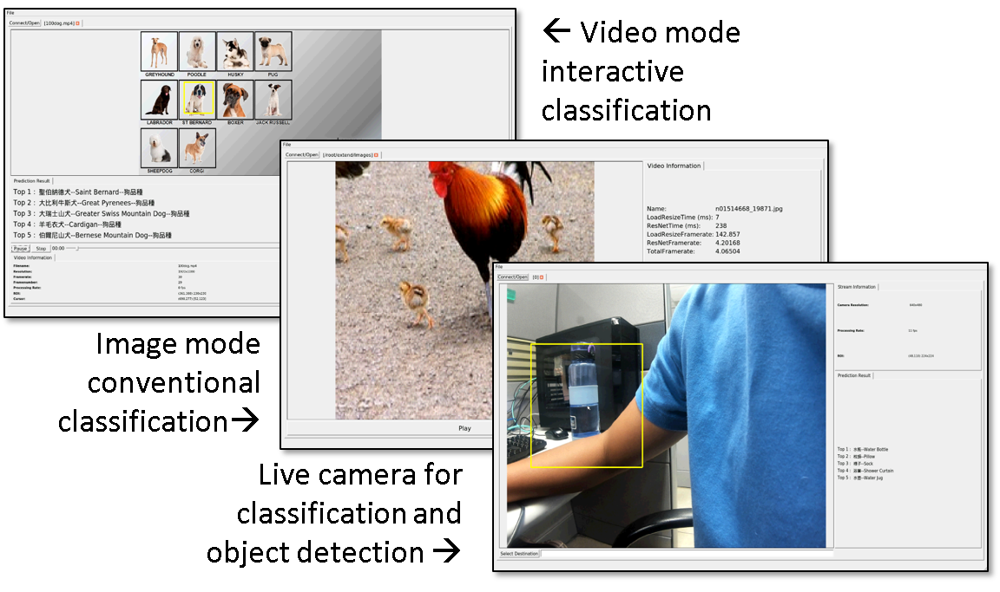

## Prebuilt DLA System on ZCU102 or ZCU104

### Prebuilt Applications
------------------

*  Live camera objection detection (Tiny YOLO), classification (Resnet50)

*  Interactive video classification, click mouse to identify

*  Conventional image classification

**DLA SPEC :** 64-MAC NV_small, 128kB, 150MHZ

**Host System :** Ubuntu 16.04

### Software Requirements
--------------------------

*  Vivado&reg; Design Suite 2018.3

*  PetaLinux Tools 2018.3

### Hardware Requirements
--------------------------

*  ZCU102 Evaluation Board or ZCU104 Evaluation Board

*  Display Port

*  12V Power Supply

*  USB Adapter (ZCU102 Requirement)

*  USB 3.0 Hub

*  USB Mouse

### Build an SD image by yourself
----------

* Prepare an SD or micro-SD card, more than 16GB is better.
* Divide the SD card with 2 partitions.
* The 1st partition is the u-boot and boot loader codes (BOOT.BIN & image.ub).
* The 2nd partition (ext4) is the media parts including the current directories.
* After boot-up the system, change to the Prebuilt/resnet_tiny-yolov1 folder, use rvm command to execute.

       % cd your_path/resnet_tiny-yolov1
       % ./rvm –platform linuxfb
 

### Directly Apply for the prebuilt SD image, to plug and play
-------------------------------------------

*  Apply for the prebuilt DLA system with the demos of classification and object detection.

    * The compressed image file is about 5GB.

    * Please fill the form through the google form https://forms.gle/TA7fu4JENSjQqwB26.

    * Or, you may send your request to scluo@itri.org.tw, with following info.

      *  Email titled: 【Try DLA】YourID 

      *  Your ID  (Name or Job Function)

      *  Affiliation (Company or School) 

      *  FPGA platform : ZCU102 or ZCU104 

      *  Brief introduction of your project

  *  We will send you the link or the image file link (google drive or ITRI file delivery).

  *  Also, if you are local, welcome to visit us for more information.

### Documents
----------

*  [Petalinux Building Tutorial](./doc/Petalinux%20Tutorial/petalinux_tutorial.pdf)

*  [Demo GUI user guide](./doc/Demo%20Start!/Demo%20Start.pdf)
